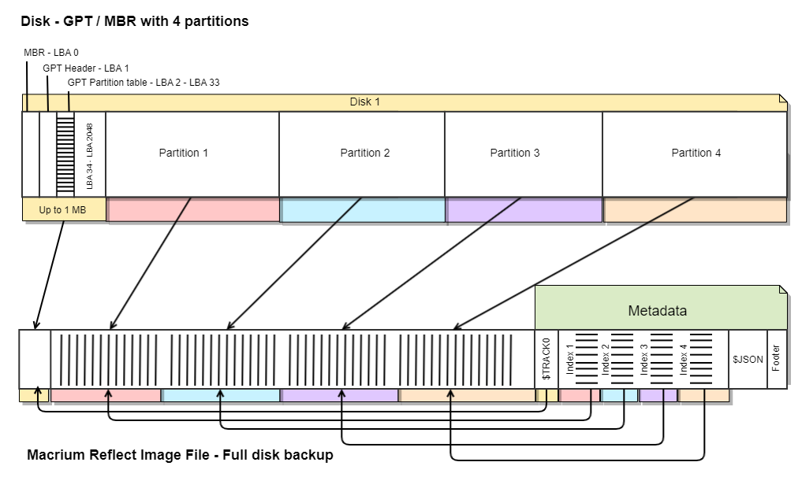
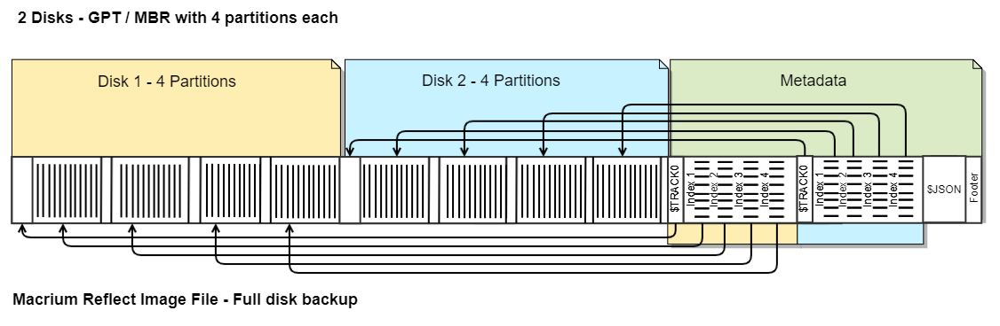
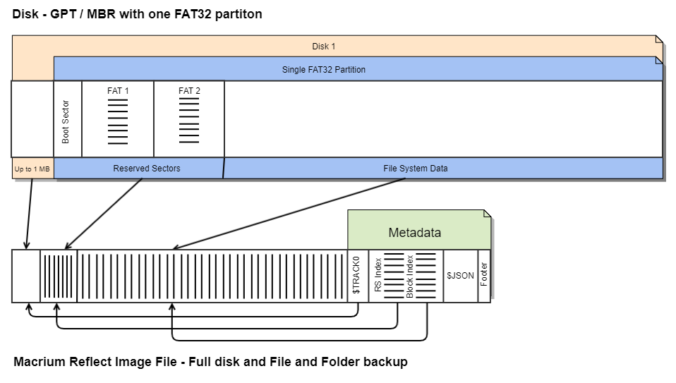
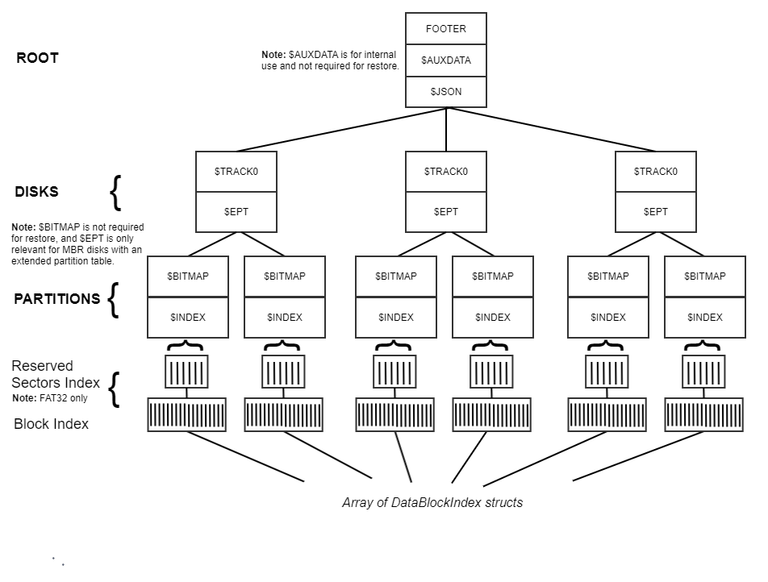

 <br>Experience data independence with love, from us to you. 


***

## Macrium Reflect X Image File layout

> [!NOTE]
> This layout is not valid for Image Files created with Macrium Reflect v8.x or earlier.
***
### Overview
The data layout in an image file is similar to that on a physical disk, including disk format, partitions, and file systems. The following diagram shows how a single disk directly maps to a full disk image. 




The following diagram shows how multiple disks map to a full disk image. The disks are arranged in sequence, with the metadata for all disks located at the end of the file.



Incremental image files contain only data blocks that are different from the prevous image in the backup set. Differential image files contain only data blocks that are different from the full image in the backup set.
> [!NOTE]
> Consolidated images may contain data blocks out of sequence and optimized for storage efficiency. All consolidated data bolcks are positioned prior to the metadata at the end of the file.

### Special considerations for FAT File Systems
FAT file systems, including FAT32/16/12, are managed differently within image files because of Reserved Sectors preceding the file system data. These reserved sectors comprise the Boot Sector, followed by up to 2 copies of the File Allocation Table (FAT).

In instances where non-standard FAT32 file systems exceed the Windows maximum of 32GB, the number of reserved sectors can be substantial. To address this, the reserved sectors data is segmented into 4MB blocks and indexed in the `Reserved Sectors Index`, which is positioned before the primary block index in the metadata. A `Reserved Sectors Index`exists for every FAT file system backed up. 

> [!NOTE]
> As with file system Data blocks, Reserved sector blocks may be compressed and/or encrypted depending on the backup settings.



> [!NOTE]
> The example above also describes the exact image file format for all Macrium `File and Folder backups`.


**Let's dive deeper by looking at the metadata elements that make up the image file:**



***
### METADATA BLOCK
***
Metadata blocks are structured to store binary data. Blocks are organized lists, and each block is preceded by a header, which provides the data's length, its encryption and compression statuses, the MD5 hash of the data, and whether this is the last block in the list.

```c++
struct HeaderFlags
{
    uint8_t last_block : 1;    // Flag indicating whether this is the last block in the file
    uint8_t compression : 1;   // Flag indicating whether the block is compressed
    uint8_t encryption : 1;    // Flag indicating whether the block is encrypted
    uint8_t unused : 5;        // Remaining unused bits
};

struct MetadataBlockHeader
{
    uint8_t  block_name[8]   // Name of the block
    uint32_t block_Length;   // Length of the block
    uint8_t   hash[16];      // MD5 hash of the block
    HeaderFlags flags;       // Flags for the block
    uint8_t padding[3];      // Padding for alignment
};
```
BlockName may be set to the following values.
```c++
// JSON data that describes the image file and supplementary backup information. 
uint8_t* const JSON_HEADER   = "$JSON   ";

// Auxiliary data for internal use. This is not required for restore. 
uint8_t* const AUX_HEADER   = "$AUXDATA";

// disk data
uint8_t* const TRACK_0       = "$TRACK0 ";
uint8_t* const EXT_PAR_TABLE = "$EPT    ";

// partition data
uint8_t* const BITMAP_HEADER = "$BITMAP ";
uint8_t* const IDX_HEADER    = "$INDEX  ";
```
Not all BlockName headers are included in this document.  <br><br>
**Reading the block list**  <br>
`If LastBlock == 0, then the next block begins at the file offset for this block + sizeof(MetadataBlockHeader) + blocklength`

***

### ROOT - FOOTER
***
At the end of each image file, a 20-byte sequence verifies the file as a Macrium Image through a 12-byte magic identifier and provides the offset to the initial Metadata block to enable the continued reading of the file. 

```c++
struct Footer
{
    uint64_t first_metadata_block_header;
    uint8_t magic_bytes[12]; // MACRIUM_FILE
};
```
***
### ROOT - METADATA BLOCKS
***
**$AUXDATA** - This optional metadata block, at the root level of the file, is for internal use only and not required to restore or read image data.
***
**$JSON** - This mandatory metadata block, at the root level of the file, is the source of navigational and supplementary information necessary for understanding and accessing the contents of the backup. This JSON text also provides auxiliary data including details about the backup environment and settings. 

| Information  | Link |
| :------------- | :------------- |
JSON Schema details | [See here](../schema)  <br>
Example Image file JSON | [See here](../schema/examples/image_1.json) <br>
Example File and Folder backup JSON | [See here](../schema/examples/file_and_folder_1.json) <br>
***
### DISK - METADATA BLOCKS
***
Position to the first Disk Metadata block file offset using the `_header`> `index_file_position` **$JSON** node:

```json
  "index_file_position": {
    "type": "integer",
    "description": "The file position for the beginning of the backup metadata, including all block indexes"
  },
```

Disks are stored as an array in the file, and the number of disks is the count of `disks`[items] in the `_header`> `disks` array **$JSON** node:

```json
{
   "disks": {
     "type": "array",
     "description": "List of disks included in the backup",
     "items": {
     }
}
```
***
**$TRACK0** - This mandatory metadata block contains the initial sectors on the disk up to the 1st partition, with a maximum size of 1,048,576 bytes (1MB). This includes the critical boot and partition data structures. For Master Boot Record (MBR) disks, it includes the MBR itself along with the partition table. For GUID Partition Table (GPT) disks, it provides the GPT header and partition table. Beyond the MBR, the extra data for MBR disks may include additional disk boot code, such as Linux's GRUB bootloader.
**Note:** $TRACK0 may be the only metadata block at disk level.

<details>
  <summary>TRACK0 Disk Structures</summary>

 
MBR formatted disks at LBA 0 (Sector 1):
```c++
struct Partition {
    uint8_t  status;
    uint8_t  start_head;
    uint16_t start_sector_cylinder;
    uint8_t  type;
    uint8_t  end_head;
    uint16_t end_sector_cylinder;
    uint32_t boot_sector_Offset;  
    uint32_t number_Of_Sectors;
} ;

struct BootRecord {
    uint8_t  boot_code[442];
    uint32_t signature;
    Partition partition_entries[4];
    uint16_t id_code;
};

```
GPT formatted disks, starting at offset LBA 1 (Sector 2) in $TRACK0:
```c++
struct GPTHeader {
    uint64_t signature;
    uint32_t revision;
    uint32_t header_size;
    uint32_t header_crc32;
    uint32_t reserved1;
    uint64_t my_lba;
    uint64_t alternate_lba;
    uint64_t first_usable_lba;
    uint64_t last_usable_lba;
    efi_guid_t disk_guid;
    uint64_t partition_entry_lba;
    uint32_t num_partition_entries;
    uint32_t sizeof_partition_entry;
    uint32_t partition_entry_array_crc32;
    uint8_t  reserved2[420];
};
```
The GPT partition table is typically at LBA 2 (sector 3), but can be found by reading the partition_entry_lba field in the gptheader struct. 
```c++
struct GPTEntryAttributes
{
    uint64_t required_to_function:1;
    uint64_t reserved:47;
    uint64_t type_guid_specific:16;
};

struct GPTTableEntry {
    efi_guid_t partition_type_guid;
    efi_guid_t unique_partition_guid;
    uint64_t starting_lba;
    uint64_t ending_lba;
    gpt_entry_attributes attributes;
    uint16_t partition_name[36];
};

```
A Windows GPT formatted disk contains an array of 128 gpt_table_entry structures. 
</details>

***
**$EPT** - This optional metadata block contains an array of `ExtendedPartitionTable` entries (Extended Boot Records), preceded by a uint32_t count of elements. 

<details>
  <summary>Extended Partition Table Disk Structures</summary>

 

```c++
struct Partition {
    uint8_t  status;
    uint8_t  start_head;
    uint16_t start_sector_cylinder;
    uint8_t  type;
    uint8_t  end_head;
    uint16_t end_sector_cylinder;
    uint32_t boot_sector_offset;  
    uint32_t number_of_sectors;
} ;

struct BootRecord {
    uint8_t  boot_code[442];
    uint32_t signature;
    Partition partition_entries[4];
    uint16_t id_code;
};

struct ExtendedPartitionTable
{
    BootRecord boot_record;
    uint64_t  disk_byte_offset;
    uint16_t  partition_number;
};
```
</details>

```c++
struct ExtendedPartitionTableEntries
{
    uint32_t count;
    ExtendedPartitionTable ExtendedPartitionTableArray[];
}
```
> [!NOTE]
> $EPT data is only populated for MBR formatted disks with an extended partition table.

***
### PARTITION - METADATA BLOCKS
***
Partitions are stored as an array in the file, and the number of partitions is the count of `partitions`[items]  found in the `_header`> `disks`[item] > `partitions` array **$JSON** node:

```json
{
  "partitions": {
    "type": "array",
    "description": "List of partitions on the disk",
    "items": {
    }
}
```
***
 **$BITMAP** - This optional metadata block contains the $BITMAP metadata related to the file system. Currently, it is only populated for exFAT and ReFS file systems. Although it provides valuable insights into the file system structure, this block is not mandatory for the restoration of the image file.
***
**$INDEX** - This required metadata block includes the `ReservedSectorsIndex` and the partition's `DataBlockIndex`. For delta incrementals, a `DeltaDataBlockIndex` replaces the `DataBlockIndex`.

Each `DataBlockIndexElement` specifies both the position and the size of a `DataBlock` within the file, where `DataBlock` contains the actual data from the imaged file system. These elements are organized in a vector list, and represent the full extent of the imaged file system. This layout enables easy location and retrieval of the stored data.


```c++
// md5_hash` is the MD5 hash of the raw data, computed after the data has been decompressed and decrypted
// This ensures that it accurately reflects the original uncompressed and decrypted content.

struct DataBlockIndexElement
{
    int64_t  file_position;  // Position of the data block in the file (64-bit integer).
    uint8_t  md5_hash[16];   // MD5 hash of the file data block (16-byte array).
    uint32_t block_length;   // Length of the data block.
    uint16_t file_number;    // Number of the file (16-bit integer).
};
```

**Reserved Sectors Index** - FAT32 Only. The `ReservedSectorsIndex` consists if a `DataBlockIndexElement` array that references the `data_block`elements from the begining of the partition to the first `data_block` in `DataBlockIndex:block_index_array` (the first file system data block).

```c++
struct ReservedSectorsIndex
{
    unit32_t index_count
    DataBlockIndexElement reserved_sectors_array[]; // dynamic array of 0 or more
}
```

**Data Block Index** - For Full, Differential and non-delta Incremental Image files:

```c++
struct DataBlockIndex
{
    unit32_t index_count
    DataBlockIndexElement block_index_array[]; //  required dynamic array
}
```

**Delta Data Block Index** - For delta Incremental Image files:

```c++

struct DeltaDataBlock
{
    DataBlockIndexElement delta_data_block;
    uint32_t block_index;  // The corresponding index value for the DataBlockIndex
};

struct DeltaDataBlockIndex
{
    unit32_t index_count
    DeltaDataBlock delta_block_index_array[]; //  required dynamic array
}
```
***
**Data Block** - A `data_block` is the raw data of the imaged file system. Each block is a fixed length per partition, and can be compressed and/or encrypted based on the backup settings. The location and size of each block are shown in a related `DataBlockIndexElement`.<br>

```c++
uint8_t data_block[block_length];
```
| Information  | Link |
| :------------- | :------------- |
Encryption Implementation | [See here](ENCRYPTION.md)
