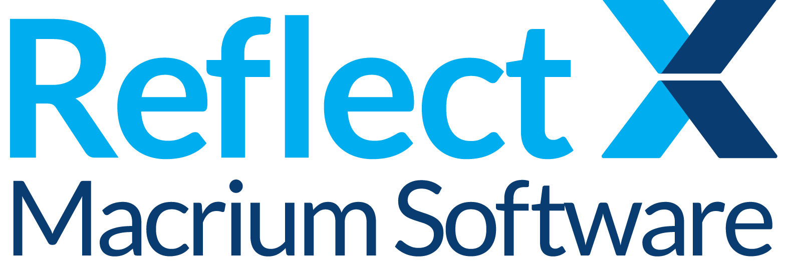

  Experience data independence with love, from us to you. 

***

# What's in this repository?

### File layout documentation
This repository provides a comprehensive guide to the format and layout of Macrium Reflect Image, as well as File and Folder backup files. Our aim is to enable our customers to access their data independently, without the need for proprietary software tools. 

[Macrium X Image File Layout](FILE_LAYOUT.md)

### Source code
We have included a Visual Studio 2022 solution and CMakeLists.txt files, which are used for managing the build process of software using CMake. The package includes libraries and an executable, `img_to_vhdx.exe`, that enables the restoration of any Macrium Reflect X Image or File and Folder backup file to a dynamically created and mounted VHDX file. All source code is licensed under the MIT License, ensuring that the tools and code needed are always freely available.

[Visual Studio 2022 Solution](../src)

### Demo
We've also provided a pre-built demo of `img_to_vhdx.exe`, bundled with a Reflect X image file and a batch file named `demo.bat`. To get started, extract the `img_to_vhdx.zip` file to any directory of your choice and execute `demo.bat`. On completion, a new VHDX file will be generated and automatically mounted, granting you full access to the data contained in the image file.

[img_to_vhdx.exe Demo](../demo)   
[img_to_vhdx.exe Usage Details](../src/IMG_TO_VHDX.md)  

***

#### Contributions
We welcome contributions from the community and are pleased to have you join us. If you would like to contribute to this project, please follow these guidelines:

- Fork the Repository: Start by forking the repository and then clone it locally to work on it.
- Create a Branch: Create a new branch in your forked repository. This keeps your changes separate from the main project.
- Implement Your Changes: Make your changes in your branch. Be sure to adhere to the [coding standards and guidelines](/src/STANDARDS.md) of the project.
- Run Tests: Ensure that your changes pass all the tests. It's also a good idea to add new tests that cover your changes.
- Submit a Pull Request: Push your changes to your fork on GitHub and then submit a pull request to the main repository. Include a clear description of what the changes do and why they should be included.
