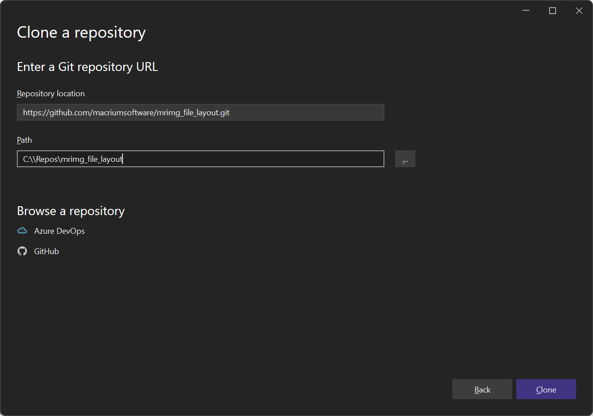
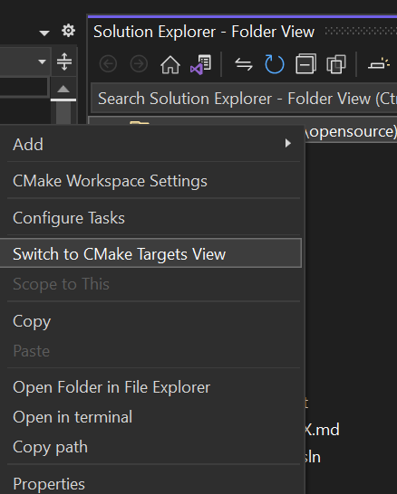
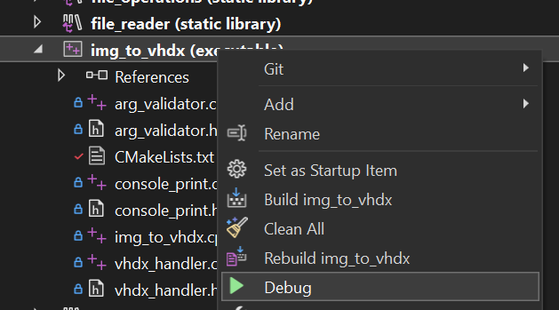

  Experience data independence with love, from us to you. 

***
# Project Source Code

This directory contains the Visual Studio 2022 solution and source code for the project. Follow the steps below to set up your environment and build the executable.

> [!NOTE]
> See [here](IMG_TO_VHDX.md) for all `img_to_vhdx.exe` command line options.
***
### Prerequisites

- [Visual Studio 2022](https://visualstudio.microsoft.com/vs/) - Ensure you have Visual Studio 2022 installed on your machine. Download it from the official website if you haven't already.

***
### Cloning the Repository

First, clone the repository to your local PC. Start VS2022 as an andministrator, and click `Clone a repository`. 
In the Repository location type `https://github.com/macriumsoftware/mrimg_file_layout.git` and enter an empty folder for the clone path:    

***
### Building with CMake

Once the clone completes, Visual Studio will populate the `Solution Explorer` tab with project files using the found CMakelists.txt files.  
Head over to `Solution Explorer`, and make sure you're viewing the `CMake Targets view`. 

> [!NOTE]
> If you don't see the `CMake Targets view` option, then close Visual Studio and re-open using the `\mrimg_file_layout\src` folder. 

Then right click on the project root node and select `Build All`.

To run `img_to_vhdx`, make sure `x64 Debug` is selected in the toolbar build combobox then right click on the `img_to_vhdx` project in the solution explorer, and click `debug`.

  

***
### Building with the VS2022 Solution file

Alternatively, to build using the VS2022 solution file. Open VS2022 as an administrator,  click `Open a Project or Solution`, navigate to the `src\` directory and select `img_to_vhdx.sln`. 

Once Visual Studio loads the project, you can build it by following these steps:

1. Select `Build > Build Solution` from the top menu or press `Ctrl+Shift+B`.
2. Ensure the build configuration is set to either `Debug` or `Release` depending on your needs.
***
### Running the Executable

See [here](IMG_TO_VHDX.md) for all command line options to use when running `img_to_vhdx.exe`. 
> [!NOTE]
> Command line parameter(s) can also be added to the `img_to_vhdx` project properties.
***
### Troubleshooting

If you encounter any issues with building or running the project, ensure that:

- You have the necessary permissions to clone and write files in the chosen directory.
- Visual Studio is updated to the latest version to avoid compatibility issues.
***
Thank you for contributing to or using our project!
